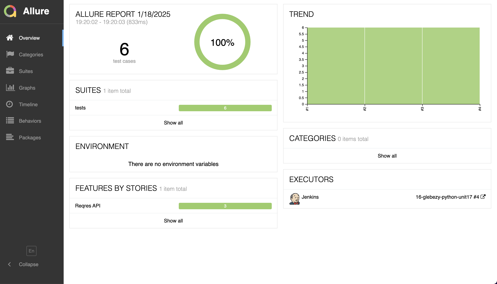
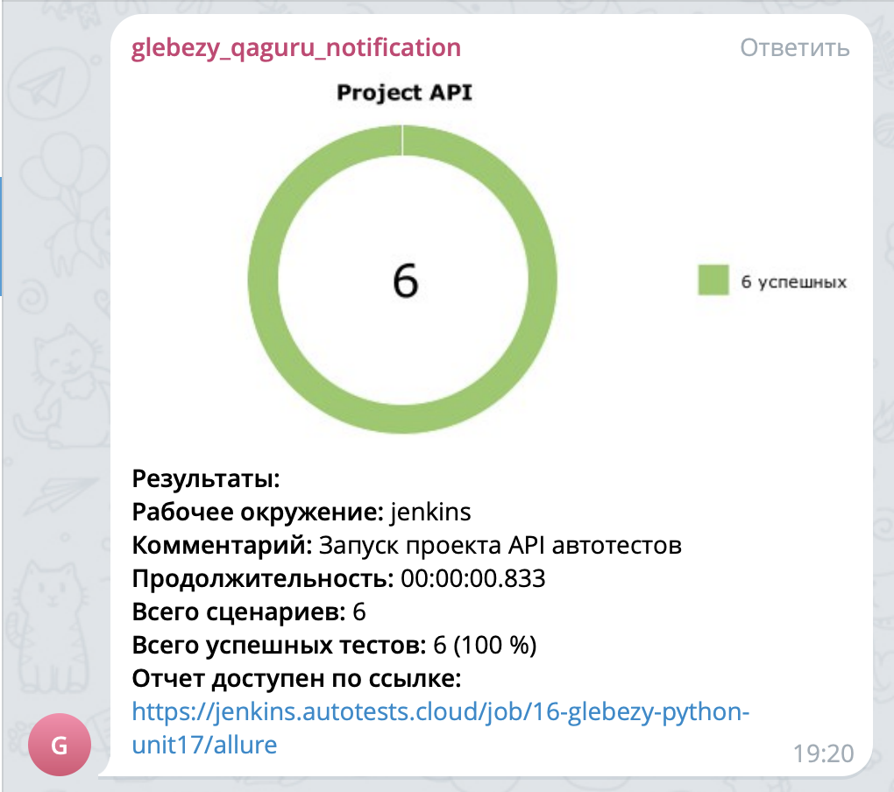

## Проект API автотестов reqres.in

<!-- Технологии -->

### Используемые технологии

  <code></code>
  <code></code>
  <code></code>
  <code></code>
  <code></code>
  <code></code>
  <code></code>
  <code></code>
  <code></code>
  <code></code>

<!-- Тест кейсы -->

### Что проверяем

* Регистрация пользователя с валидными данными
* Удаление пользователя
* Получение данных существующего пользователя
* Получение данных несуществующего пользователя
* Регистрация пользователя с невалидными данными
* Изменение данных ресурса

<!-- Jenkins -->

###  Запуск проекта в Jenkins

### [Job](https://jenkins.autotests.cloud/job/16-glebezy-python-unit17/)

##### При нажатии на "Build Now" начнется сборка тестов и их прохождение, через виртуальную машину в Selenide.

<!-- Allure report -->

###  Allure report

##### После прохождения тестов, результаты можно посмотреть в Allure отчете

##### Во вкладке Graphs можно посмотреть графики о прохождении тестов, по их приоритизации, по времени прохождения и др.

##### Во вкладке Behaviors находятся собранные тест кейсы, у которых описаны шаги и приложены логи о прохождении теста

<!-- Telegram -->

###  Интеграция с Telegram

##### После прохождения тестов, в Telegram-бот приходит сообщение с графиком и небольшой информацией о тестах.

